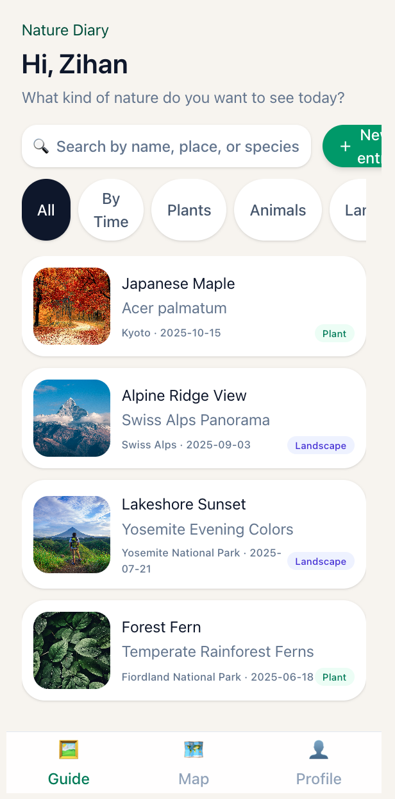
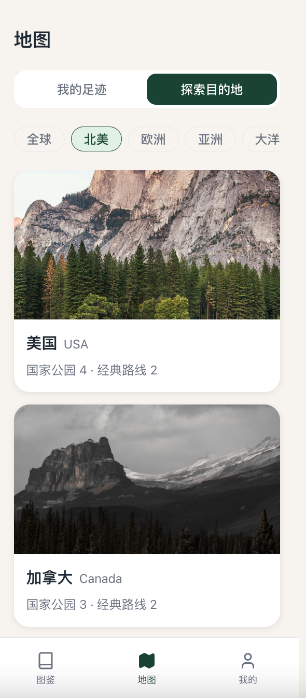
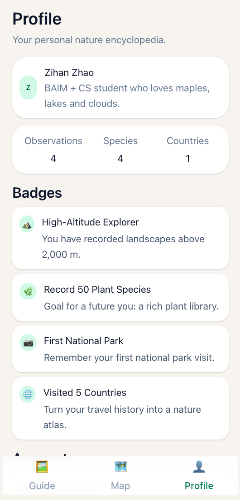
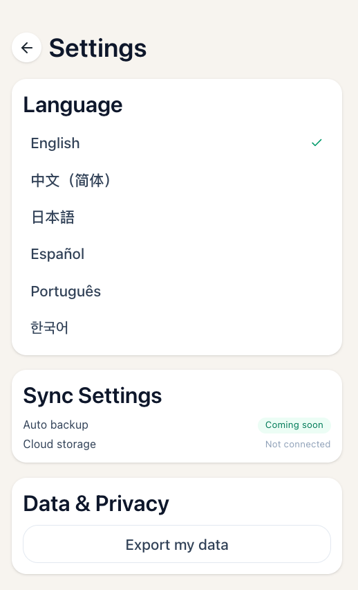

# Nature Diary · Personal Nature Encyclopedia

A student project that turns everyday outdoor observations into a structured
**nature encyclopedia** – with species taxonomy, rich context, and a visual gallery.
Designed for future integration with smart glasses + AI vision.

> Figma for the full mobile UI design, Python + Streamlit for the runnable demo.

---

## 1. Project Overview

Nature Diary is a concept app for hikers, travelers and nature lovers.
You take a photo of a plant, animal or landscape, add a short voice note,
and the system turns it into a structured entry:

- for organisms: full taxonomy (kingdom → species) + encyclopedia description,
- for landscapes: geology & formation,
- all tied to time, GPS location and your personal memory of that moment.

This repository contains:

- the **design** (Figma link + screenshots),
- a small **Python data model** for observations and taxonomy,
- and a **Streamlit demo** that shows a gallery + detail view.

## Quickstart – Run the Streamlit demo

This repository includes a minimal Streamlit demo that shows how the data model
projects into a simple UI.

```bash
# 1. Clone and enter the project
git clone https://github.com/ZihanZhao227/nature-diary.git
cd nature-diary

# 2. (Optional but recommended) create a virtual environment
python -m venv .venv
source .venv/bin/activate  # on Windows: .venv\Scripts\activate

# 3. Install dependencies
pip install -r requirements.txt

# 4. Run the Streamlit app
streamlit run app/app.py
```
Then open http://localhost:8501 in your browser.

The demo reads sample observations from backend/demo_data.json and renders a
small gallery:

- left side: filter + list of observations
- right side: detail view with image, location, time and basic metadata

## Design prototype

The full mobile UI/UX is designed in Figma.

- See `design/figma-link.md` for the prototype link and design notes.

---

## 2. Features (current demo)

- 📚 **Observation gallery** – card-based list, filter by time and type (plant / animal / landscape)
- 🔍 **Detail page** – location, time, altitude, coordinates + placeholders for:
  - taxonomy (kingdom / phylum / class / order / family / genus / species)
  - encyclopedia info (native range, habitat, edibility, human uses, ecology)
  - geology & formation for landscapes
- 🗺️ **Explore by country** – sample country pages with national parks and classic trails
- 👣 **My footprints** – shows countries “visited” in this demo and some of the user’s observations
- 🏅 **Badges** – unlocked by visiting high-altitude areas or collecting enough species

Planned (not yet implemented):

- AI-powered species recognition from images
- automatic generation of taxonomy + encyclopedia description using LLMs
- integration with smart glasses as a “hands-free nature guide”

---

## 3. Tech Stack

- **Language:** Python 3.11
- **UI:** Streamlit
- **Data:** JSON sample files
- **Design:** Figma (mobile-first interface)

---

## 4. Figma Design

The full mobile UI is designed in Figma:

- [Figma file link](<https://www.figma.com/make/XF5F0VYicpI0H01BgWg7fI/Nature-Diary-App-Design?t=4xlKvkLD43aDZZUf-0>)

Key screens:






---

## 5. Repository Structure

```text
.
├── README.md
├── requirements.txt
├── design/
│   ├── figma-link.md
│   ├── home.png
│   ├── map.png
│   └── profile.png
├── backend/
│   ├── __init__.py
│   ├── models.py
│   └── demo_data.json
├── app/
│   └── app.py
└── docs/
    └── architecture.md
```
---
## 6. How to run the demo
```text
# 1. Clone the repo
git clone https://github.com/<your-username>/nature-diary.git
cd nature-diary

# 2. Create env and install deps
python -m venv .venv
source .venv/bin/activate   # Windows: .venv\Scripts\activate
pip install -r requirements.txt

# 3. Run the Streamlit app
streamlit run app/app.py

```
Then open the URL shown in the terminal (usually http://localhost:8501
)
to explore the Nature Diary demo.

---
## 7. Future Work

- Add real taxonomy & encyclopedia content for more species
- Connect to vision + LLM APIs to auto-generate entries
- Sync with mobile devices / smart glasses
- Offline “safety pack” for hikers (hazardous species, weather alerts, etc.)


